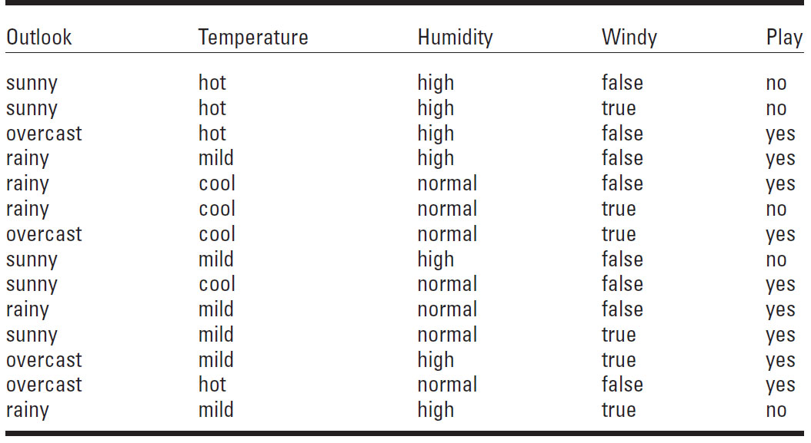
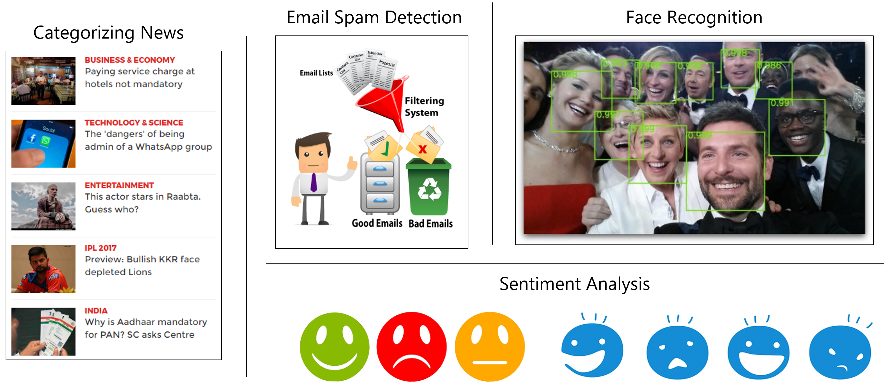
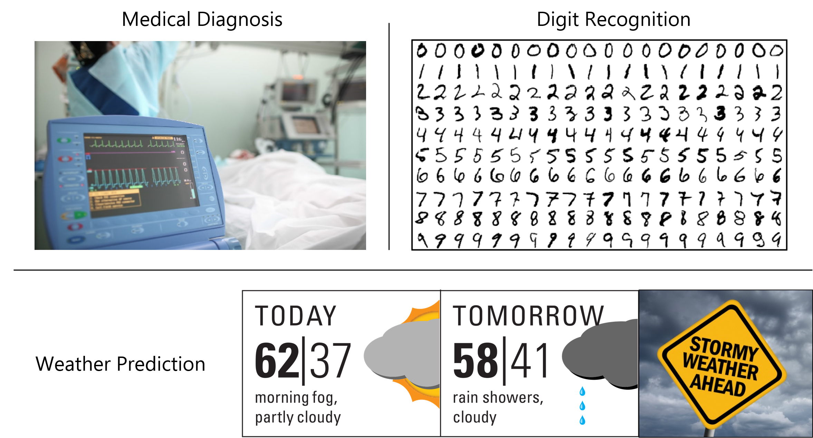

# Naive Bayes Assumptions and Applications

## Introduction
Naive Bayes classifier is a simple yet powerful algorithm for the classification problems. Even with highly complicated datasets, it is suggested to try Naive Bayes approach first before trying more sophisticated classifiers. In this lesson, we shall look at some properties, assumptions and applications of Naive Bayes Classifiers to help you develop a motivation around using it in appropriate analytical problems. 
## Objectives
You will be able to:
* Understand different flavors of Naive Bayes in terms of distributions of underlying data
* Explain the i.i.d assumption and how it works with Naive Bayes
* Discuss and understand some key use cases of Naive Bayes Classifier. 

## Types of Naive Bayes Algorithm

Naive Bayes Algorithm works with a number of data distributions for classification tasks. Here are three popular distributions that would routinely come across while doing data analysis. 

### Gaussian Naive Bayes

When data features values are continuous (i.e. real numbers), NAive Bayes makes the the assumption that the values associated with each class are distributed according to Gaussian/Normal Distribution.

If in our data, an attribute say $x$ contains continuous data. We first segment the data by the class and then compute mean $\mu_{y}$ and Variance ${\sigma_{y}}^{2}$  of each class.

$$P(x_i \mid y) = \frac{1}{\sqrt{2\pi\sigma^2_y}} \exp\left(-\frac{(x_i - \mu_y)^2}{2\sigma^2_y}\right)$$

We shall see this approach in practice in the upcoming labs where we take a deep dive into Gaussian Naive Bayes. 

### MultiNomial Naive Bayes

MultiNomial Naive Bayes is preferred to use on data that is multinomially distributed. 

>In probability theory, the **Multinomial distribution** is a generalization of the binomial distribution. For example, it models the probability of counts for rolling a k-sided die n times. For n independent trials each of which leads to a success for exactly one of k categories, with each category having a given fixed success probability, the multinomial distribution gives the probability of any particular combination of numbers of successes for the various categories. (wiki)

It is one of the standard classic algorithms, used often with text categorization (classification). Each event in text classification represents the occurrence of a word in a document. [Visit here](https://syncedreview.com/2017/07/17/applying-multinomial-naive-bayes-to-nlp-problems-a-practical-explanation/) for an example on this. 

### Bernoulli Naive Bayes

Bernoulli Naive Bayes is used on the data that is distributed according to multivariate Bernoulli distributions.i.e., multiple features can be there, but each one is assumed to be a binary-valued (Bernoulli, boolean) variable. So, it requires features to be binary valued. In the context of text data , one can think of categorizing incoming emails as ham / spam etc. Have a quick look at the detailed slides [HERE](http://www.inf.ed.ac.uk/teaching/courses/inf2b/learnSlides/inf2b13-learnlec07-nup.pdf) to see this in action. We shall be developing a similar experiment towards the end of this section. 

The Bernoulli and Multinomial text models created in Naive Bayes following a "Bag of Words" approach perform with similar level of accuracy as more high end classifiers. 

## Naive Bayes Assumptions

The fundamental Naive Bayes assumption is that each feature makes an **independent** and **equal** (i.e. are identical) contribution to the outcome. This is known as the **i.i.d assumption**. 

Let's look at a brief data and try to understand the assumptions. Here we are looking at a number of weather features and target variable "play" which indicates weather you would go out and play football given these features. 

### Assumption 1. 

> No pair of features are dependent. - The independence Assumption

For example, the temperature being "Hot" has nothing to do with the humidity being "high" or the outlook being "Rainy" has no effect on the winds. Hence, the features are assumed to be independent.

### Assumption 2.
> Each feature is given the same weight(or importance). - The Equality/Identical Assumption

For example, knowing only temperature and humidity alone can’t predict the outcome accuratey. None of the attributes is irrelevant and assumed to be contributing equally to the outcome.

*Note: The assumptions made by Naive Bayes are not generally correct in real-world situations. In-fact, the independence assumption is never correct but often works well in practice.*

## Naive Bayes Applications

Naive Bayes has been successfully used towards categorizing news, email spam detection, face recognition, sentiment analysis, medical diagnosis, digit recognition and weather prediction  etc.

Naive Bayes , performs extremely well for all above applications. This algorithm is a classic example of how a very simple algorithm can be used to solve problems of cognitive nature (i.e. requiring human understanding) like facial recognition. 

[Here is an excellent discussion on Quora](https://www.quora.com/In-what-real-world-applications-is-Naive-Bayes-classifier-used) about Naive Bayes algorithm with links to resources that you can visit to re-enforce the concepts covered so far in this section. 

## Summary 

In this short lesson, we looked some properties of naive Bayes in terms of the distributions that can be processed using this classifier. We looked the assumptions needed for this algorithm to work and also quickly saw application areas and use cases. Following this , we shall look into Gaussian and Bernoulli Naive Bayes (Multinomial is just a special case with multiple classes) while working with some medical data and cancer classification and a simple text classification experiment. 
